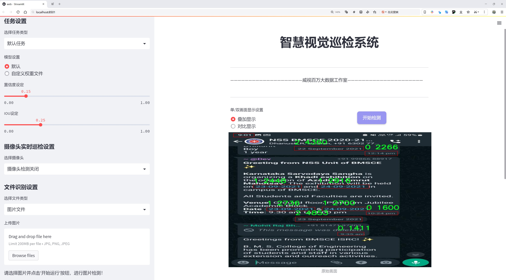
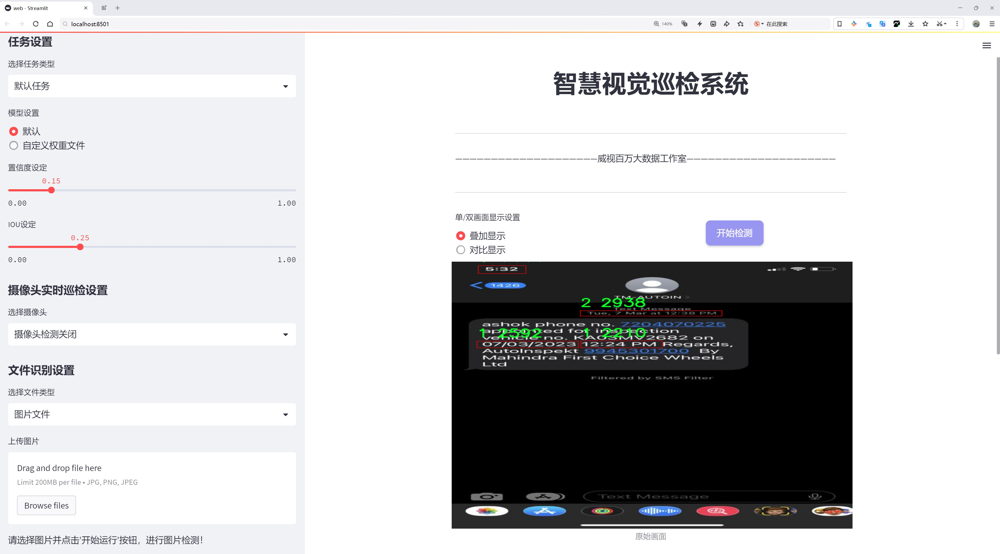
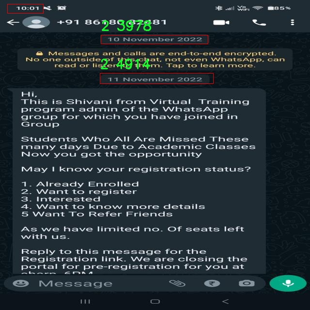
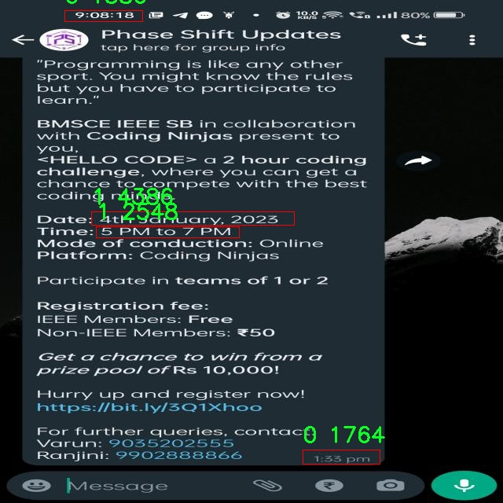
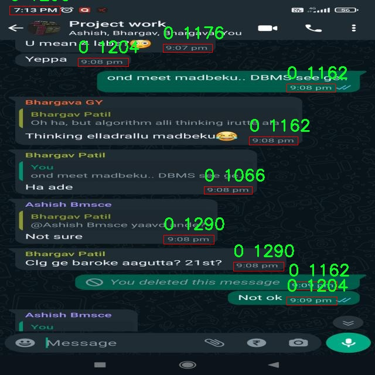
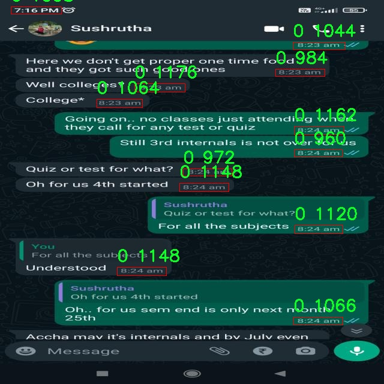
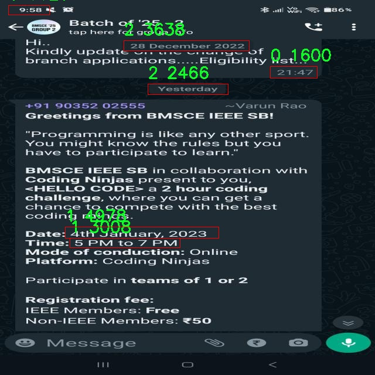

# 时间戳检测检测系统源码分享
 # [一条龙教学YOLOV8标注好的数据集一键训练_70+全套改进创新点发刊_Web前端展示]

### 1.研究背景与意义

项目参考[AAAI Association for the Advancement of Artificial Intelligence](https://gitee.com/qunmasj/projects)

项目来源[AACV Association for the Advancement of Computer Vision](https://kdocs.cn/l/cszuIiCKVNis)

研究背景与意义

随着信息技术的迅猛发展，数据的生成与处理速度不断加快，如何有效地从海量数据中提取有价值的信息成为了一个重要的研究课题。在这一背景下，计算机视觉技术的应用日益广泛，尤其是在目标检测领域，已经成为智能化系统的重要组成部分。YOLO（You Only Look Once）系列模型以其高效的实时检测能力和较高的准确率，逐渐成为目标检测领域的主流方法。YOLOv8作为该系列的最新版本，凭借其改进的网络结构和优化的算法，展现出了更强的性能和更高的适应性。因此，基于YOLOv8的时间戳检测系统的研究具有重要的理论价值和实际意义。

时间戳信息在许多应用场景中扮演着至关重要的角色，尤其是在视频监控、智能交通、金融交易等领域。准确的时间戳不仅能够为事件的发生提供重要的时间线索，还能为后续的数据分析和决策提供可靠的依据。然而，传统的时间戳提取方法往往依赖于人工标注或简单的图像处理技术，效率低下且易受环境因素的影响。因此，基于深度学习的自动化时间戳检测系统的研究显得尤为迫切。

本研究所采用的数据集包含1781张图像，涵盖了6个类别的时间戳信息，包括数字时间（0、1、2）、系统日期时间（sysdatetime）、系统时间（systime）和用户时间（usertime）。这些类别的多样性为模型的训练提供了丰富的样本，有助于提高模型对不同时间戳格式的识别能力。同时，数据集的规模也为模型的泛化能力提供了良好的基础。通过对这些数据的深入分析和处理，可以有效提升时间戳检测的准确性和鲁棒性。

在研究过程中，改进YOLOv8模型的架构和训练策略，将有助于提升其在时间戳检测任务中的表现。通过引入更为精细的特征提取机制和优化的损失函数，可以使模型更好地适应时间戳的多样性和复杂性。此外，针对不同类别的时间戳，设计相应的分类策略，将进一步提升检测的精度和效率。这不仅为目标检测技术的发展提供了新的思路，也为实际应用中的时间戳提取提供了更为可靠的解决方案。

综上所述，基于改进YOLOv8的时间戳检测系统的研究，不仅具有重要的学术价值，还能为实际应用提供切实可行的技术支持。通过深入探讨时间戳检测的相关问题，推动目标检测技术在更多领域的应用，将为智能化社会的建设贡献一份力量。

### 2.图片演示






##### 注意：由于此博客编辑较早，上面“2.图片演示”和“3.视频演示”展示的系统图片或者视频可能为老版本，新版本在老版本的基础上升级如下：（实际效果以升级的新版本为准）

  （1）适配了YOLOV8的“目标检测”模型和“实例分割”模型，通过加载相应的权重（.pt）文件即可自适应加载模型。

  （2）支持“图片识别”、“视频识别”、“摄像头实时识别”三种识别模式。

  （3）支持“图片识别”、“视频识别”、“摄像头实时识别”三种识别结果保存导出，解决手动导出（容易卡顿出现爆内存）存在的问题，识别完自动保存结果并导出到tempDir中。

  （4）支持Web前端系统中的标题、背景图等自定义修改，后面提供修改教程。

  另外本项目提供训练的数据集和训练教程,暂不提供权重文件（best.pt）,需要您按照教程进行训练后实现图片演示和Web前端界面演示的效果。

### 3.视频演示

[3.1 视频演示](https://www.bilibili.com/video/BV1Pkxue4EKQ/)

### 4.数据集信息展示

##### 4.1 本项目数据集详细数据（类别数＆类别名）

nc: 3
names: ['0', '1', '2']


##### 4.2 本项目数据集信息介绍

数据集信息展示

在本研究中，我们采用了名为“TimeStamp”的数据集，以支持对YOLOv8模型在时间戳检测系统中的改进。该数据集专门设计用于训练和评估时间戳识别的性能，具有独特的结构和多样化的样本，以确保模型在实际应用中的准确性和鲁棒性。

“TimeStamp”数据集包含三个主要类别，分别标记为‘0’，‘1’和‘2’，这些类别代表了不同类型的时间戳或其变体。这种分类方式不仅有助于模型学习时间戳的基本特征，还能够提高其在复杂场景下的识别能力。具体而言，类别‘0’可能代表标准的时间戳格式，而类别‘1’和‘2’则可能对应于不同的时间戳变体或样式，例如带有不同字体、颜色或背景的时间戳。这种多样性使得数据集在训练过程中能够涵盖更广泛的应用场景，从而提升模型的泛化能力。

数据集的构建过程中，研究团队对样本进行了精心挑选和标注，确保每个类别的样本数量均衡，且样本质量高。每个样本都经过严格的预处理，以消除噪声和干扰，确保模型在训练时能够专注于时间戳的关键特征。此外，数据集中的样本来源广泛，涵盖了不同的环境和条件，例如不同的光照、角度和背景，这进一步增强了模型的适应性。

在数据集的使用过程中，我们采用了数据增强技术，以扩展训练样本的多样性。通过对原始图像进行旋转、缩放、裁剪和颜色调整等操作，我们能够生成更多的训练样本，从而提高模型的鲁棒性和准确性。这种方法不仅可以有效防止过拟合，还能使模型在面对未知数据时表现得更加出色。

在训练阶段，我们将“TimeStamp”数据集分为训练集和验证集，以便在训练过程中实时监控模型的性能。训练集用于模型的学习，而验证集则用于评估模型在未见数据上的表现。这种分割策略确保了模型能够在真实场景中具备良好的识别能力。

通过对“TimeStamp”数据集的深入分析和应用，我们期望能够显著提升YOLOv8在时间戳检测任务中的表现。随着时间戳识别技术的不断发展，准确的时间戳检测不仅在视频监控、交通管理等领域具有重要意义，还在许多自动化系统中扮演着关键角色。因此，构建一个高质量的时间戳数据集并进行有效的模型训练，将为未来的研究和应用奠定坚实的基础。

总之，“TimeStamp”数据集的设计和实施为YOLOv8模型的改进提供了强有力的支持。通过对数据集的精心构建和多样化的样本选择，我们期待在时间戳检测领域取得突破性进展，推动相关技术的进一步发展。











### 5.全套项目环境部署视频教程（零基础手把手教学）

[5.1 环境部署教程链接（零基础手把手教学）](https://www.ixigua.com/7404473917358506534?logTag=c807d0cbc21c0ef59de5)


[5.2 安装Python虚拟环境创建和依赖库安装视频教程链接（零基础手把手教学）](https://www.ixigua.com/7404474678003106304?logTag=1f1041108cd1f708b01a)

### 6.手把手YOLOV8训练视频教程（零基础小白有手就能学会）

[6.1 手把手YOLOV8训练视频教程（零基础小白有手就能学会）](https://www.ixigua.com/7404477157818401292?logTag=d31a2dfd1983c9668658)

### 7.70+种全套YOLOV8创新点代码加载调参视频教程（一键加载写好的改进模型的配置文件）

[7.1 70+种全套YOLOV8创新点代码加载调参视频教程（一键加载写好的改进模型的配置文件）](https://www.ixigua.com/7404478314661806627?logTag=29066f8288e3f4eea3a4)

### 8.70+种全套YOLOV8创新点原理讲解（非科班也可以轻松写刊发刊，V10版本正在科研待更新）

由于篇幅限制，每个创新点的具体原理讲解就不一一展开，具体见下列网址中的创新点对应子项目的技术原理博客网址【Blog】：


[8.1 70+种全套YOLOV8创新点原理讲解链接](https://gitee.com/qunmasj/good)

### 9.系统功能展示（检测对象为举例，实际内容以本项目数据集为准）

图9.1.系统支持检测结果表格显示

  图9.2.系统支持置信度和IOU阈值手动调节

  图9.3.系统支持自定义加载权重文件best.pt(需要你通过步骤5中训练获得)

  图9.4.系统支持摄像头实时识别

  图9.5.系统支持图片识别

  图9.6.系统支持视频识别

  图9.7.系统支持识别结果文件自动保存

  图9.8.系统支持Excel导出检测结果数据


### 10.原始YOLOV8算法原理

原始YOLOv8算法原理

YOLOv8算法是YOLO系列目标检测模型的最新版本，基于YOLOv5和YOLOv7的架构进行了一系列优化和改进。该算法的设计理念旨在提高目标检测的速度和精度，同时保持模型的轻量化特性，使其能够在资源受限的环境中高效运行。YOLOv8的网络结构主要由输入层、主干网络、特征融合层和解耦头组成，这些部分共同协作，实现了对目标的高效检测。

在YOLOv8的主干网络中，采用了CSPDarknet的思想，结合了C2f模块的设计，取代了YOLOv5中的C3模块。C2f模块的引入不仅有效减小了模型的规模，还在保持检测精度的前提下，增强了特征提取的能力。C2f模块通过引入ELAN思想，采用了双分支结构，分别对特征进行处理和融合。第一个分支直接将特征送入Concat层，而第二个分支则通过多个Bottleneck模块进行处理，最终将两个分支的特征叠加，形成更为丰富的特征表示。这种设计使得YOLOv8能够更好地捕捉到图像中的细节信息，并有效缓解了深层网络中的梯度消失问题。

特征融合层是YOLOv8的重要组成部分，采用了PAN-FPN结构，以实现多尺度特征的有效融合。该结构通过自下而上的上采样和自上而下的下采样相结合，充分利用了不同层次的特征信息。在这一过程中，YOLOv8对YOLOv5的上采样阶段进行了优化，去除了冗余的卷积层，使得特征融合更加高效。特征融合的结果将被送入解耦头进行后续的目标分类和边框回归。

YOLOv8的解耦头结构是其另一大创新之处。与传统的耦合头不同，YOLOv8采用了Anchor-Free的设计理念，取消了对锚框的依赖，直接对特征图进行分类和回归。这一设计不仅简化了模型的结构，还提高了检测的灵活性和准确性。解耦头的输出包括三个不同尺度的特征图，分别对应于不同大小的目标，从而确保了对各种目标的有效检测。

在损失函数的设计上，YOLOv8引入了VFLLoss和DFLLoss+CIoULoss的组合，以提高分类和回归的精度。VFLLoss通过对样本的预测概率进行加权，解决了正负样本不平衡的问题；而DFLLoss则通过积分形式表示法，增强了对小目标的检测能力。这种损失函数的设计，使得YOLOv8在处理复杂场景时，能够更好地应对小目标和难以分类的样本。

在数据预处理方面，YOLOv8继承了YOLOv5的策略，采用了多种数据增强技术，如马赛克增强、混合增强、空间扰动和颜色扰动等。这些增强手段有效提升了模型的鲁棒性，使其在面对不同环境和条件下的图像时，依然能够保持良好的检测性能。

总体而言，YOLOv8算法通过一系列的结构优化和设计创新，成功地在目标检测领域实现了更高的效率和精度。其轻量化的特性使得该模型在实际应用中具有广泛的适用性，尤其是在需要实时处理的场景中，YOLOv8展现出了优越的性能。随着YOLOv8的不断发展和完善，未来的目标检测任务将能够更为高效和准确地完成，为计算机视觉领域带来新的机遇和挑战。


### 11.项目核心源码讲解（再也不用担心看不懂代码逻辑）

#### 11.1 70+种YOLOv8算法改进源码大全和调试加载训练教程（非必要）\ultralytics\models\yolo\segment\val.py

以下是对代码的核心部分进行分析和详细注释的结果：

```python
# 引入必要的库
from multiprocessing.pool import ThreadPool
from pathlib import Path
import numpy as np
import torch
import torch.nn.functional as F
from ultralytics.models.yolo.detect import DetectionValidator
from ultralytics.utils import LOGGER, NUM_THREADS, ops
from ultralytics.utils.checks import check_requirements
from ultralytics.utils.metrics import SegmentMetrics, box_iou, mask_iou
from ultralytics.utils.plotting import output_to_target, plot_images

class SegmentationValidator(DetectionValidator):
    """
    继承自DetectionValidator类，用于基于分割模型的验证。
    """

    def __init__(self, dataloader=None, save_dir=None, pbar=None, args=None, _callbacks=None):
        """初始化SegmentationValidator并将任务设置为'segment'，度量标准设置为SegmentMetrics。"""
        super().__init__(dataloader, save_dir, pbar, args, _callbacks)
        self.plot_masks = None  # 用于存储绘制的掩码
        self.process = None  # 处理掩码的函数
        self.args.task = 'segment'  # 设置任务类型为分割
        self.metrics = SegmentMetrics(save_dir=self.save_dir, on_plot=self.on_plot)  # 初始化度量标准

    def preprocess(self, batch):
        """预处理批次，将掩码转换为浮点数并发送到设备。"""
        batch = super().preprocess(batch)  # 调用父类的预处理方法
        batch['masks'] = batch['masks'].to(self.device).float()  # 将掩码转移到设备并转换为浮点数
        return batch

    def init_metrics(self, model):
        """初始化度量标准并根据save_json标志选择掩码处理函数。"""
        super().init_metrics(model)  # 调用父类的初始化方法
        self.plot_masks = []  # 初始化绘制掩码的列表
        if self.args.save_json:
            check_requirements('pycocotools>=2.0.6')  # 检查pycocotools的版本要求
            self.process = ops.process_mask_upsample  # 更精确的掩码处理
        else:
            self.process = ops.process_mask  # 更快的掩码处理

    def postprocess(self, preds):
        """后处理YOLO预测并返回输出检测结果。"""
        # 应用非极大值抑制以过滤重叠的检测框
        p = ops.non_max_suppression(preds[0],
                                     self.args.conf,
                                     self.args.iou,
                                     labels=self.lb,
                                     multi_label=True,
                                     agnostic=self.args.single_cls,
                                     max_det=self.args.max_det,
                                     nc=self.nc)
        proto = preds[1][-1] if len(preds[1]) == 3 else preds[1]  # 获取第二个输出
        return p, proto  # 返回处理后的预测结果和原型

    def update_metrics(self, preds, batch):
        """更新度量标准。"""
        for si, (pred, proto) in enumerate(zip(preds[0], preds[1])):
            idx = batch['batch_idx'] == si  # 获取当前批次的索引
            cls = batch['cls'][idx]  # 获取当前批次的类别
            bbox = batch['bboxes'][idx]  # 获取当前批次的边界框
            nl, npr = cls.shape[0], pred.shape[0]  # 标签数量和预测数量
            shape = batch['ori_shape'][si]  # 获取原始图像的形状
            correct_masks = torch.zeros(npr, self.niou, dtype=torch.bool, device=self.device)  # 初始化正确掩码
            correct_bboxes = torch.zeros(npr, self.niou, dtype=torch.bool, device=self.device)  # 初始化正确边界框
            self.seen += 1  # 增加已处理的样本数量

            if npr == 0:  # 如果没有预测
                if nl:
                    self.stats.append((correct_bboxes, correct_masks, *torch.zeros((2, 0), device=self.device), cls.squeeze(-1)))
                continue

            # 处理掩码
            midx = [si] if self.args.overlap_mask else idx  # 根据重叠掩码的参数选择索引
            gt_masks = batch['masks'][midx]  # 获取真实掩码
            pred_masks = self.process(proto, pred[:, 6:], pred[:, :4], shape=batch['img'][si].shape[1:])  # 处理预测掩码

            # 处理预测框
            if self.args.single_cls:
                pred[:, 5] = 0  # 如果是单类检测，将类别设置为0
            predn = pred.clone()  # 克隆预测结果
            ops.scale_boxes(batch['img'][si].shape[1:], predn[:, :4], shape, ratio_pad=batch['ratio_pad'][si])  # 缩放边界框

            # 评估
            if nl:  # 如果有标签
                height, width = batch['img'].shape[2:]  # 获取图像的高度和宽度
                tbox = ops.xywh2xyxy(bbox) * torch.tensor((width, height, width, height), device=self.device)  # 转换为xyxy格式
                ops.scale_boxes(batch['img'][si].shape[1:], tbox, shape, ratio_pad=batch['ratio_pad'][si])  # 缩放标签框
                labelsn = torch.cat((cls, tbox), 1)  # 合并类别和边界框
                correct_bboxes = self._process_batch(predn, labelsn)  # 处理边界框
                correct_masks = self._process_batch(predn, labelsn, pred_masks, gt_masks, overlap=self.args.overlap_mask, masks=True)  # 处理掩码
                if self.args.plots:
                    self.confusion_matrix.process_batch(predn, labelsn)  # 更新混淆矩阵

            # 追加正确的掩码和边界框
            self.stats.append((correct_bboxes, correct_masks, pred[:, 4], pred[:, 5], cls.squeeze(-1)))

            pred_masks = torch.as_tensor(pred_masks, dtype=torch.uint8)  # 转换掩码为uint8类型
            if self.args.plots and self.batch_i < 3:
                self.plot_masks.append(pred_masks[:15].cpu())  # 过滤前15个掩码以进行绘制

            # 保存结果
            if self.args.save_json:
                pred_masks = ops.scale_image(pred_masks.permute(1, 2, 0).contiguous().cpu().numpy(), shape, ratio_pad=batch['ratio_pad'][si])
                self.pred_to_json(predn, batch['im_file'][si], pred_masks)  # 保存为JSON格式

    def _process_batch(self, detections, labels, pred_masks=None, gt_masks=None, overlap=False, masks=False):
        """
        返回正确预测矩阵。

        参数:
            detections (array[N, 6]), x1, y1, x2, y2, conf, class
            labels (array[M, 5]), class, x1, y1, x2, y2

        返回:
            correct (array[N, 10]), 对于10个IoU级别
        """
        if masks:
            if overlap:
                nl = len(labels)
                index = torch.arange(nl, device=gt_masks.device).view(nl, 1, 1) + 1
                gt_masks = gt_masks.repeat(nl, 1, 1)  # 扩展真实掩码
                gt_masks = torch.where(gt_masks == index, 1.0, 0.0)  # 将掩码转换为二进制格式
            if gt_masks.shape[1:] != pred_masks.shape[1:]:
                gt_masks = F.interpolate(gt_masks[None], pred_masks.shape[1:], mode='bilinear', align_corners=False)[0]  # 重新调整掩码大小
                gt_masks = gt_masks.gt_(0.5)  # 二值化掩码
            iou = mask_iou(gt_masks.view(gt_masks.shape[0], -1), pred_masks.view(pred_masks.shape[0], -1))  # 计算IoU
        else:  # 处理边界框
            iou = box_iou(labels[:, 1:], detections[:, :4])  # 计算边界框的IoU

        return self.match_predictions(detections[:, 5], labels[:, 0], iou)  # 匹配预测和标签

    def plot_predictions(self, batch, preds, ni):
        """绘制批次预测结果，包括掩码和边界框。"""
        plot_images(
            batch['img'],
            *output_to_target(preds[0], max_det=15),  # 不设置为self.args.max_det以提高绘图速度
            torch.cat(self.plot_masks, dim=0) if len(self.plot_masks) else self.plot_masks,
            paths=batch['im_file'],
            fname=self.save_dir / f'val_batch{ni}_pred.jpg',
            names=self.names,
            on_plot=self.on_plot)  # 绘制预测结果
        self.plot_masks.clear()  # 清空绘制掩码列表
```

### 代码核心部分说明
1. **类 SegmentationValidator**: 该类用于处理基于分割的模型验证，继承自 `DetectionValidator`。
2. **初始化方法**: 设置任务类型为分割，并初始化度量标准。
3. **预处理方法**: 将输入批次中的掩码转换为浮点数并发送到设备。
4. **初始化度量标准**: 根据是否保存JSON选择不同的掩码处理方法。
5. **后处理方法**: 应用非极大值抑制，过滤重叠的检测框，并返回处理后的预测结果。
6. **更新度量标准**: 处理每个批次的预测结果，计算正确的掩码和边界框，并更新统计信息。
7. **处理批次**: 计算IoU并返回正确的预测矩阵。
8. **绘制预测结果**: 将预测结果可视化，包括掩码和边界框。

这些核心部分共同构成了分割模型验证的主要逻辑，处理输入数据、计算指标、生成可视化结果等。

这个文件是一个用于YOLOv8模型的分割验证器的实现，继承自`DetectionValidator`类，主要用于处理图像分割任务的验证过程。首先，导入了一些必要的库，包括多线程处理、路径操作、NumPy和PyTorch等。接着，定义了`SegmentationValidator`类，构造函数中初始化了一些属性，包括数据加载器、保存目录、进度条、参数和回调函数，并将任务类型设置为“分割”。

在`preprocess`方法中，对输入的批次数据进行预处理，将掩码转换为浮点数并发送到指定的设备（如GPU）。`init_metrics`方法用于初始化评估指标，并根据是否需要保存JSON格式的结果选择掩码处理函数。`get_desc`方法返回格式化的评估指标描述。

`postprocess`方法对YOLO模型的预测结果进行后处理，使用非极大值抑制来过滤预测框，并返回处理后的预测和原型。`update_metrics`方法则负责更新评估指标，计算预测的掩码和边界框的正确性，并将结果存储在统计信息中。

`finalize_metrics`方法设置评估指标的速度和混淆矩阵。`_process_batch`方法用于处理每个批次的检测结果和标签，计算IoU（交并比）并返回正确的预测矩阵。`plot_val_samples`和`plot_predictions`方法用于绘制验证样本和预测结果的图像。

`pred_to_json`方法将预测结果保存为JSON格式，使用RLE（游程编码）对掩码进行编码。`eval_json`方法用于评估COCO风格的目标检测指标，检查保存的JSON文件并使用pycocotools库进行评估。

整体而言，这个文件实现了YOLOv8分割模型的验证流程，包括数据预处理、指标计算、结果保存和可视化等功能，适用于图像分割任务的模型评估。

#### 11.2 ui.py

以下是保留的核心代码部分，并添加了详细的中文注释：

```python
import sys
import subprocess

def run_script(script_path):
    """
    使用当前 Python 环境运行指定的脚本。

    Args:
        script_path (str): 要运行的脚本路径

    Returns:
        None
    """
    # 获取当前 Python 解释器的路径
    python_path = sys.executable

    # 构建运行命令，使用 streamlit 运行指定的脚本
    command = f'"{python_path}" -m streamlit run "{script_path}"'

    # 执行命令
    result = subprocess.run(command, shell=True)
    # 检查命令执行的返回码，0 表示成功，非0表示出错
    if result.returncode != 0:
        print("脚本运行出错。")

# 实例化并运行应用
if __name__ == "__main__":
    # 指定要运行的脚本路径
    script_path = "web.py"  # 这里可以替换为实际的脚本路径

    # 调用函数运行脚本
    run_script(script_path)
```

### 代码注释说明：
1. **导入模块**：
   - `sys`：用于获取当前 Python 解释器的路径。
   - `subprocess`：用于执行外部命令。

2. **`run_script` 函数**：
   - 接收一个参数 `script_path`，表示要运行的 Python 脚本的路径。
   - 使用 `sys.executable` 获取当前 Python 解释器的路径，以确保在当前环境中运行脚本。
   - 构建命令字符串，使用 `streamlit` 模块运行指定的脚本。
   - 使用 `subprocess.run` 执行构建的命令，并检查返回码以判断脚本是否成功运行。

3. **主程序块**：
   - 在脚本作为主程序运行时，指定要运行的脚本路径（此处为 `web.py`）。
   - 调用 `run_script` 函数来执行指定的脚本。

这个程序文件的主要功能是使用当前的 Python 环境来运行一个指定的脚本，具体来说是一个名为 `web.py` 的脚本。文件首先导入了必要的模块，包括 `sys`、`os` 和 `subprocess`，这些模块提供了与系统交互的功能。

在 `run_script` 函数中，首先获取当前 Python 解释器的路径，这样可以确保在正确的环境中运行脚本。接着，构建一个命令字符串，这个命令使用了 `streamlit` 模块来运行指定的脚本。`streamlit` 是一个用于构建数据应用的流行库，命令的格式是将 Python 解释器与 `-m streamlit run` 结合起来，并传入脚本的路径。

随后，使用 `subprocess.run` 方法来执行这个命令。这个方法会在新的进程中运行命令，并等待其完成。如果命令执行的返回码不为零，表示脚本运行过程中出现了错误，此时会打印出一条错误信息。

在文件的最后部分，使用 `if __name__ == "__main__":` 语句来确保只有在直接运行该文件时才会执行下面的代码。这里指定了要运行的脚本路径，即 `web.py`，并调用 `run_script` 函数来执行这个脚本。

总的来说，这个程序文件的作用是方便地在当前 Python 环境中运行一个特定的脚本，并处理可能出现的错误。

#### 11.3 code\ultralytics\engine\trainer.py

以下是代码中最核心的部分，并附上详细的中文注释：

```python
class BaseTrainer:
    """
    BaseTrainer类是用于训练模型的基类，包含训练过程中的主要逻辑和参数设置。
    """

    def __init__(self, cfg=DEFAULT_CFG, overrides=None, _callbacks=None):
        """
        初始化BaseTrainer类。

        参数:
            cfg (str, optional): 配置文件的路径，默认为DEFAULT_CFG。
            overrides (dict, optional): 配置覆盖，默认为None。
        """
        self.args = get_cfg(cfg, overrides)  # 获取配置
        self.check_resume(overrides)  # 检查是否需要从上次训练恢复
        self.device = select_device(self.args.device, self.args.batch)  # 选择训练设备
        self.validator = None  # 验证器
        self.metrics = None  # 评估指标
        self.plots = {}  # 存储绘图数据
        init_seeds(self.args.seed + 1 + RANK, deterministic=self.args.deterministic)  # 初始化随机种子

        # 创建保存结果的目录
        self.save_dir = get_save_dir(self.args)
        self.args.name = self.save_dir.name  # 更新日志名称
        self.wdir = self.save_dir / "weights"  # 权重保存目录
        if RANK in (-1, 0):
            self.wdir.mkdir(parents=True, exist_ok=True)  # 创建目录
            self.args.save_dir = str(self.save_dir)
            yaml_save(self.save_dir / "args.yaml", vars(self.args))  # 保存运行参数
        self.last, self.best = self.wdir / "last.pt", self.wdir / "best.pt"  # 检查点路径
        self.save_period = self.args.save_period  # 保存周期

        self.batch_size = self.args.batch  # 批量大小
        self.epochs = self.args.epochs  # 训练轮数
        self.start_epoch = 0  # 起始轮数
        if RANK == -1:
            print_args(vars(self.args))  # 打印参数

        # 设备设置
        if self.device.type in ("cpu", "mps"):
            self.args.workers = 0  # 在CPU上加速训练

        # 模型和数据集设置
        self.model = check_model_file_from_stem(self.args.model)  # 检查模型文件
        try:
            if self.args.task == "classify":
                self.data = check_cls_dataset(self.args.data)  # 检查分类数据集
            elif self.args.data.split(".")[-1] in ("yaml", "yml") or self.args.task in ("detect", "segment", "pose"):
                self.data = check_det_dataset(self.args.data)  # 检查检测数据集
                if "yaml_file" in self.data:
                    self.args.data = self.data["yaml_file"]  # 更新数据路径
        except Exception as e:
            raise RuntimeError(emojis(f"数据集 '{clean_url(self.args.data)}' 错误 ❌ {e}")) from e

        self.trainset, self.testset = self.get_dataset(self.data)  # 获取训练和测试数据集
        self.ema = None  # 指数移动平均

        # 优化相关初始化
        self.lf = None  # 损失函数
        self.scheduler = None  # 学习率调度器

        # 轮次级别的指标
        self.best_fitness = None  # 最佳适应度
        self.fitness = None  # 当前适应度
        self.loss = None  # 当前损失
        self.tloss = None  # 总损失
        self.loss_names = ["Loss"]  # 损失名称列表
        self.csv = self.save_dir / "results.csv"  # 结果CSV文件路径
        self.plot_idx = [0, 1, 2]  # 绘图索引

        # 回调函数
        self.callbacks = _callbacks or callbacks.get_default_callbacks()  # 获取默认回调
        if RANK in (-1, 0):
            callbacks.add_integration_callbacks(self)  # 添加集成回调

    def train(self):
        """开始训练过程。"""
        # 计算世界大小（用于多GPU训练）
        if isinstance(self.args.device, str) and len(self.args.device):
            world_size = len(self.args.device.split(","))
        elif isinstance(self.args.device, (tuple, list)):
            world_size = len(self.args.device)
        elif torch.cuda.is_available():
            world_size = 1  # 默认使用设备0
        else:
            world_size = 0  # 使用CPU

        # 如果是分布式数据并行训练，执行子进程
        if world_size > 1 and "LOCAL_RANK" not in os.environ:
            cmd, file = generate_ddp_command(world_size, self)  # 生成DDP命令
            try:
                LOGGER.info(f'{colorstr("DDP:")} 调试命令 {" ".join(cmd)}')
                subprocess.run(cmd, check=True)  # 运行命令
            except Exception as e:
                raise e
            finally:
                ddp_cleanup(self, str(file))  # 清理DDP

        else:
            self._do_train(world_size)  # 正常训练

    def _do_train(self, world_size=1):
        """执行训练过程，包括验证和绘图。"""
        if world_size > 1:
            self._setup_ddp(world_size)  # 设置分布式数据并行
        self._setup_train(world_size)  # 设置训练

        nb = len(self.train_loader)  # 批次数
        nw = max(round(self.args.warmup_epochs * nb), 100) if self.args.warmup_epochs > 0 else -1  # 预热迭代次数
        last_opt_step = -1  # 上一次优化步骤
        self.epoch_time_start = time.time()  # 记录开始时间
        self.train_time_start = time.time()  # 记录训练开始时间
        self.run_callbacks("on_train_start")  # 运行训练开始回调
        LOGGER.info(
            f'图像大小 {self.args.imgsz} 训练, {self.args.imgsz} 验证\n'
            f'使用 {self.train_loader.num_workers * (world_size or 1)} 数据加载工作线程\n'
            f"结果记录到 {colorstr('bold', self.save_dir)}\n"
            f'开始训练 ' + (f"{self.args.time} 小时..." if self.args.time else f"{self.epochs} 轮...")
        )

        for epoch in range(self.start_epoch, self.epochs):
            self.epoch = epoch  # 当前轮数
            self.run_callbacks("on_train_epoch_start")  # 运行每轮开始回调
            self.model.train()  # 设置模型为训练模式
            if RANK != -1:
                self.train_loader.sampler.set_epoch(epoch)  # 设置采样器的轮数
            pbar = enumerate(self.train_loader)  # 迭代训练数据

            self.tloss = None  # 初始化总损失
            self.optimizer.zero_grad()  # 清空优化器的梯度
            for i, batch in pbar:
                self.run_callbacks("on_train_batch_start")  # 运行每批开始回调

                # 前向传播
                with torch.cuda.amp.autocast(self.amp):  # 使用自动混合精度
                    batch = self.preprocess_batch(batch)  # 预处理批次
                    self.loss, self.loss_items = self.model(batch)  # 计算损失
                    if RANK != -1:
                        self.loss *= world_size  # 如果是DDP训练，损失乘以世界大小
                    self.tloss = (
                        (self.tloss * i + self.loss_items) / (i + 1) if self.tloss is not None else self.loss_items
                    )  # 更新总损失

                # 反向传播
                self.scaler.scale(self.loss).backward()  # 使用缩放的损失进行反向传播

                # 优化步骤
                if ni - last_opt_step >= self.accumulate:
                    self.optimizer_step()  # 执行优化步骤
                    last_opt_step = ni  # 更新上一次优化步骤

                # 日志记录
                mem = f"{torch.cuda.memory_reserved() / 1E9 if torch.cuda.is_available() else 0:.3g}G"  # 记录内存使用
                if RANK in (-1, 0):
                    pbar.set_description(
                        ("%11s" * 2 + "%11.4g" * (2 + loss_len))
                        % (f"{epoch + 1}/{self.epochs}", mem, *losses, batch["cls"].shape[0], batch["img"].shape[-1])
                    )  # 更新进度条描述

                self.run_callbacks("on_train_batch_end")  # 运行每批结束回调

            self.run_callbacks("on_train_epoch_end")  # 运行每轮结束回调

        if RANK in (-1, 0):
            self.final_eval()  # 最终评估
            self.run_callbacks("on_train_end")  # 运行训练结束回调
        torch.cuda.empty_cache()  # 清空GPU缓存

    def optimizer_step(self):
        """执行优化器的单步更新，包括梯度裁剪和EMA更新。"""
        self.scaler.unscale_(self.optimizer)  # 反缩放梯度
        torch.nn.utils.clip_grad_norm_(self.model.parameters(), max_norm=10.0)  # 裁剪梯度
        self.scaler.step(self.optimizer)  # 更新优化器
        self.scaler.update()  # 更新缩放器
        self.optimizer.zero_grad()  # 清空优化器的梯度
        if self.ema:
            self.ema.update(self.model)  # 更新EMA

    def validate(self):
        """
        在测试集上运行验证，返回包含“fitness”键的指标字典。
        """
        metrics = self.validator(self)  # 运行验证
        fitness = metrics.pop("fitness", -self.loss.detach().cpu().numpy())  # 获取适应度
        if not self.best_fitness or self.best_fitness < fitness:
            self.best_fitness = fitness  # 更新最佳适应度
        return metrics, fitness  # 返回指标和适应度
```

### 代码核心部分的功能概述：
1. **BaseTrainer类**：这是一个训练模型的基类，负责初始化参数、设置设备、加载数据集和模型等。
2. **train方法**：启动训练过程，支持多GPU训练。
3. **_do_train方法**：执行训练过程，包括前向传播、反向传播和优化步骤。
4. **optimizer_step方法**：进行优化器的更新，包含梯度裁剪和EMA更新。
5. **validate方法**：在验证集上评估模型性能，并返回评估指标。

这些核心部分是训练YOLO模型的基础，确保模型能够正确地进行训练和评估。

这个程序文件是一个用于训练YOLO（You Only Look Once）模型的基础类，名为`BaseTrainer`，它是Ultralytics YOLO框架的一部分。该类提供了训练模型所需的各种功能和方法，包括模型初始化、数据加载、训练过程管理、优化器设置、回调处理等。

首先，文件开头定义了一些必要的库和模块，包括数学运算、文件操作、时间处理、PyTorch相关的模块等。接着，`BaseTrainer`类的构造函数`__init__`初始化了一些重要的属性，例如训练参数、模型、数据集、回调函数等。它通过`get_cfg`函数获取配置，并检查是否需要从检查点恢复训练。

在训练过程中，`train`方法会根据设备的可用性设置分布式训练的环境，并根据需要调用`_do_train`方法进行实际的训练过程。训练过程包括设置学习率调度器、初始化模型、设置优化器等。`_setup_train`方法会处理模型的冻结层、数据加载器的构建以及优化器的设置。

训练的核心在于`_do_train`方法，它负责迭代训练数据集，进行前向传播、损失计算、反向传播和优化步骤。它还会处理每个epoch的开始和结束，记录训练进度，并在每个batch结束时进行日志记录和可视化。

在训练过程中，`validate`方法会在验证集上评估模型性能，并根据评估结果更新最佳性能指标。模型的保存和恢复也在`save_model`和`resume_training`方法中处理，这些方法确保在训练过程中定期保存模型的状态，并能够从中断的地方恢复训练。

此外，类中还定义了一些辅助方法，例如`build_optimizer`用于构建优化器，`get_dataset`用于获取训练和验证数据集的路径，`preprocess_batch`用于处理输入数据等。

总的来说，这个文件提供了一个全面的框架，用于训练YOLO模型，涵盖了从数据准备到模型训练、验证和保存的各个方面。通过这个类，用户可以方便地进行模型训练，并根据需要进行定制和扩展。

#### 11.4 train.py

以下是经过简化并添加详细中文注释的核心代码部分：

```python
import random
import numpy as np
import torch.nn as nn
from ultralytics.data import build_dataloader, build_yolo_dataset
from ultralytics.engine.trainer import BaseTrainer
from ultralytics.models import yolo
from ultralytics.nn.tasks import DetectionModel
from ultralytics.utils import LOGGER, RANK
from ultralytics.utils.torch_utils import de_parallel, torch_distributed_zero_first

class DetectionTrainer(BaseTrainer):
    """
    扩展自 BaseTrainer 类的检测模型训练类。
    """

    def build_dataset(self, img_path, mode="train", batch=None):
        """
        构建 YOLO 数据集。

        参数:
            img_path (str): 包含图像的文件夹路径。
            mode (str): 模式为 `train` 或 `val`，用户可以为每种模式自定义不同的增强。
            batch (int, optional): 批次大小，适用于 `rect` 模式。默认为 None。
        """
        gs = max(int(de_parallel(self.model).stride.max() if self.model else 0), 32)
        return build_yolo_dataset(self.args, img_path, batch, self.data, mode=mode, rect=mode == "val", stride=gs)

    def get_dataloader(self, dataset_path, batch_size=16, rank=0, mode="train"):
        """构造并返回数据加载器。"""
        assert mode in ["train", "val"]
        with torch_distributed_zero_first(rank):  # 在 DDP 中仅初始化数据集 *.cache 一次
            dataset = self.build_dataset(dataset_path, mode, batch_size)
        shuffle = mode == "train"  # 训练模式下打乱数据
        workers = self.args.workers if mode == "train" else self.args.workers * 2
        return build_dataloader(dataset, batch_size, workers, shuffle, rank)  # 返回数据加载器

    def preprocess_batch(self, batch):
        """对一批图像进行预处理，包括缩放和转换为浮点数。"""
        batch["img"] = batch["img"].to(self.device, non_blocking=True).float() / 255  # 将图像转换为浮点数并归一化
        if self.args.multi_scale:  # 如果启用多尺度
            imgs = batch["img"]
            sz = (
                random.randrange(self.args.imgsz * 0.5, self.args.imgsz * 1.5 + self.stride)
                // self.stride
                * self.stride
            )  # 随机选择图像大小
            sf = sz / max(imgs.shape[2:])  # 计算缩放因子
            if sf != 1:
                ns = [
                    math.ceil(x * sf / self.stride) * self.stride for x in imgs.shape[2:]
                ]  # 计算新的形状
                imgs = nn.functional.interpolate(imgs, size=ns, mode="bilinear", align_corners=False)  # 进行插值缩放
            batch["img"] = imgs
        return batch

    def set_model_attributes(self):
        """设置模型的属性，包括类别数量和名称。"""
        self.model.nc = self.data["nc"]  # 将类别数量附加到模型
        self.model.names = self.data["names"]  # 将类别名称附加到模型
        self.model.args = self.args  # 将超参数附加到模型

    def get_model(self, cfg=None, weights=None, verbose=True):
        """返回 YOLO 检测模型。"""
        model = DetectionModel(cfg, nc=self.data["nc"], verbose=verbose and RANK == -1)
        if weights:
            model.load(weights)  # 加载权重
        return model

    def plot_training_samples(self, batch, ni):
        """绘制带有注释的训练样本。"""
        plot_images(
            images=batch["img"],
            batch_idx=batch["batch_idx"],
            cls=batch["cls"].squeeze(-1),
            bboxes=batch["bboxes"],
            paths=batch["im_file"],
            fname=self.save_dir / f"train_batch{ni}.jpg",
            on_plot=self.on_plot,
        )
```

### 代码核心部分说明：
1. **构建数据集**：`build_dataset` 方法用于构建 YOLO 数据集，支持训练和验证模式，并允许用户自定义数据增强。
2. **获取数据加载器**：`get_dataloader` 方法用于构造数据加载器，确保在分布式训练中只初始化一次数据集。
3. **预处理批次**：`preprocess_batch` 方法对输入图像进行预处理，包括归一化和多尺度调整。
4. **设置模型属性**：`set_model_attributes` 方法将类别数量和名称等属性附加到模型中。
5. **获取模型**：`get_model` 方法返回一个 YOLO 检测模型，并可选择加载预训练权重。
6. **绘制训练样本**：`plot_training_samples` 方法用于可视化训练样本及其注释，便于检查数据的正确性。

这个程序文件 `train.py` 是一个用于训练目标检测模型的脚本，主要基于 YOLO（You Only Look Once）模型架构。它继承自 `BaseTrainer` 类，提供了一系列方法来构建数据集、加载数据、预处理图像、设置模型属性、获取模型、验证模型、记录损失、绘制训练样本和绘制训练指标等功能。

首先，文件导入了一些必要的库和模块，包括数学运算、随机数生成、深度学习框架 PyTorch 相关的模块，以及 Ultralytics 提供的工具和数据处理模块。接着，定义了 `DetectionTrainer` 类，这个类的主要功能是训练基于 YOLO 的目标检测模型。

在 `build_dataset` 方法中，程序根据传入的图像路径和模式（训练或验证）构建 YOLO 数据集。这个方法允许用户为不同的模式自定义数据增强策略，并返回构建好的数据集。

`get_dataloader` 方法用于构建和返回数据加载器。它会根据模式选择是否打乱数据，并根据训练或验证的需要设置工作线程的数量。该方法还确保在分布式训练时，数据集只初始化一次，以提高效率。

`preprocess_batch` 方法负责对输入的图像批次进行预处理，包括将图像缩放到合适的大小并转换为浮点数格式。该方法支持多尺度训练，通过随机选择图像大小来增强模型的鲁棒性。

`set_model_attributes` 方法用于设置模型的属性，包括类别数量和类别名称。这些属性会在模型训练过程中使用，以确保模型能够正确处理输入数据。

`get_model` 方法返回一个 YOLO 检测模型的实例，并在需要时加载预训练权重。`get_validator` 方法则返回一个用于验证模型性能的验证器。

`label_loss_items` 方法用于生成一个包含训练损失项的字典，这对于目标检测和分割任务是必要的。它将损失项转换为浮点数并进行格式化，以便于后续的记录和分析。

`progress_string` 方法返回一个格式化的字符串，显示训练进度，包括当前的训练轮次、GPU 内存使用情况、损失值、实例数量和图像大小等信息。

`plot_training_samples` 方法用于绘制训练样本及其标注，帮助可视化训练过程中的数据。`plot_metrics` 方法则从 CSV 文件中绘制训练指标，便于分析模型的训练效果。最后，`plot_training_labels` 方法创建一个带有标注的训练图，展示模型在训练数据上的表现。

总体而言，这个文件提供了一个完整的训练框架，涵盖了从数据准备到模型训练和评估的各个方面，为用户提供了一个高效的目标检测模型训练工具。

#### 11.5 code\ultralytics\nn\modules\transformer.py

以下是代码中最核心的部分，并附上详细的中文注释：

```python
import torch
import torch.nn as nn
import torch.nn.functional as F

class TransformerEncoderLayer(nn.Module):
    """定义单个Transformer编码器层。"""

    def __init__(self, c1, cm=2048, num_heads=8, dropout=0.0, act=nn.GELU(), normalize_before=False):
        """初始化TransformerEncoderLayer，设置参数。"""
        super().__init__()
        self.ma = nn.MultiheadAttention(c1, num_heads, dropout=dropout, batch_first=True)
        self.fc1 = nn.Linear(c1, cm)  # 前馈网络的第一层
        self.fc2 = nn.Linear(cm, c1)  # 前馈网络的第二层
        self.norm1 = nn.LayerNorm(c1)  # 第一层归一化
        self.norm2 = nn.LayerNorm(c1)  # 第二层归一化
        self.dropout = nn.Dropout(dropout)  # dropout层
        self.dropout1 = nn.Dropout(dropout)  # 第一层dropout
        self.dropout2 = nn.Dropout(dropout)  # 第二层dropout
        self.act = act  # 激活函数
        self.normalize_before = normalize_before  # 是否在前向传播前进行归一化

    def forward_post(self, src, src_mask=None, src_key_padding_mask=None, pos=None):
        """后归一化的前向传播。"""
        q = k = src + (pos if pos is not None else 0)  # 添加位置编码
        src2 = self.ma(q, k, value=src, attn_mask=src_mask, key_padding_mask=src_key_padding_mask)[0]
        src = src + self.dropout1(src2)  # 残差连接
        src = self.norm1(src)  # 归一化
        src2 = self.fc2(self.dropout(self.act(self.fc1(src))))  # 前馈网络
        src = src + self.dropout2(src2)  # 残差连接
        return self.norm2(src)  # 最终归一化

    def forward(self, src, src_mask=None, src_key_padding_mask=None, pos=None):
        """通过编码器模块进行前向传播。"""
        if self.normalize_before:
            return self.forward_pre(src, src_mask, src_key_padding_mask, pos)
        return self.forward_post(src, src_mask, src_key_padding_mask, pos)

class MSDeformAttn(nn.Module):
    """多尺度可变形注意力模块。"""

    def __init__(self, d_model=256, n_levels=4, n_heads=8, n_points=4):
        """初始化多尺度可变形注意力模块。"""
        super().__init__()
        self.d_model = d_model
        self.n_levels = n_levels
        self.n_heads = n_heads
        self.n_points = n_points
        self.sampling_offsets = nn.Linear(d_model, n_heads * n_levels * n_points * 2)  # 采样偏移量
        self.attention_weights = nn.Linear(d_model, n_heads * n_levels * n_points)  # 注意力权重
        self.value_proj = nn.Linear(d_model, d_model)  # 值的投影
        self.output_proj = nn.Linear(d_model, d_model)  # 输出的投影

    def forward(self, query, refer_bbox, value, value_shapes, value_mask=None):
        """执行多尺度可变形注意力的前向传播。"""
        value = self.value_proj(value)  # 投影值
        if value_mask is not None:
            value = value.masked_fill(value_mask[..., None], float(0))  # 应用掩码
        # 计算采样偏移量和注意力权重
        sampling_offsets = self.sampling_offsets(query).view(bs, len_q, self.n_heads, self.n_levels, self.n_points, 2)
        attention_weights = self.attention_weights(query).view(bs, len_q, self.n_heads, self.n_levels * self.n_points)
        attention_weights = F.softmax(attention_weights, -1).view(bs, len_q, self.n_heads, self.n_levels, self.n_points)
        # 计算采样位置并执行多尺度可变形注意力
        output = multi_scale_deformable_attn_pytorch(value, value_shapes, sampling_locations, attention_weights)
        return self.output_proj(output)  # 返回最终输出

class DeformableTransformerDecoderLayer(nn.Module):
    """可变形Transformer解码器层。"""

    def __init__(self, d_model=256, n_heads=8, d_ffn=1024, dropout=0.0, act=nn.ReLU(), n_levels=4, n_points=4):
        """初始化可变形Transformer解码器层。"""
        super().__init__()
        self.self_attn = nn.MultiheadAttention(d_model, n_heads, dropout=dropout)  # 自注意力
        self.cross_attn = MSDeformAttn(d_model, n_levels, n_heads, n_points)  # 交叉注意力
        self.linear1 = nn.Linear(d_model, d_ffn)  # 前馈网络的第一层
        self.linear2 = nn.Linear(d_ffn, d_model)  # 前馈网络的第二层

    def forward(self, embed, refer_bbox, feats, shapes, padding_mask=None, attn_mask=None, query_pos=None):
        """执行整个解码器层的前向传播。"""
        # 自注意力
        tgt = self.self_attn(embed, embed, embed, attn_mask=attn_mask)[0] + embed
        # 交叉注意力
        tgt = self.cross_attn(tgt, refer_bbox.unsqueeze(2), feats, shapes, padding_mask) + tgt
        # 前馈网络
        tgt = self.linear2(F.relu(self.linear1(tgt))) + tgt
        return tgt  # 返回最终输出

class DeformableTransformerDecoder(nn.Module):
    """可变形Transformer解码器的实现。"""

    def __init__(self, hidden_dim, decoder_layer, num_layers):
        """初始化可变形Transformer解码器。"""
        super().__init__()
        self.layers = nn.ModuleList([decoder_layer for _ in range(num_layers)])  # 多层解码器

    def forward(self, embed, refer_bbox, feats, shapes, padding_mask=None, attn_mask=None):
        """执行整个解码器的前向传播。"""
        output = embed
        for layer in self.layers:
            output = layer(output, refer_bbox, feats, shapes, padding_mask, attn_mask)  # 逐层传递
        return output  # 返回最终输出
```

### 代码核心部分说明：
1. **TransformerEncoderLayer**：实现了Transformer编码器的基本结构，包括自注意力机制和前馈网络，支持前后归一化的选项。
2. **MSDeformAttn**：实现了多尺度可变形注意力机制，能够根据输入的查询和参考框动态调整注意力分配。
3. **DeformableTransformerDecoderLayer**：实现了解码器层，包含自注意力和交叉注意力，适用于处理目标检测等任务。
4. **DeformableTransformerDecoder**：将多个解码器层组合在一起，形成完整的解码器结构。

这些模块是实现Transformer模型的关键组成部分，广泛应用于计算机视觉任务中，如目标检测和图像分割。

这个程序文件定义了一些与Transformer相关的模块，主要用于构建深度学习模型，特别是在计算机视觉任务中，如目标检测。文件中包含多个类，每个类实现了不同的功能，下面是对这些类及其功能的详细说明。

首先，`TransformerEncoderLayer`类定义了Transformer编码器的单层结构。它的构造函数接受多个参数，包括输入特征的维度、隐藏层的维度、头数、dropout比率等。该类使用了多头自注意力机制和前馈神经网络。它支持两种前向传播方式：后归一化和前归一化，具体取决于`normalize_before`参数的设置。`forward`方法根据该参数选择相应的前向传播实现。

接下来，`AIFI`类是`TransformerEncoderLayer`的一个子类，主要用于实现AIFI Transformer层。它在前向传播中构建了2D正弦余弦位置嵌入，并将输入张量进行变形，以适应后续的Transformer操作。

`TransformerLayer`类实现了一个基本的Transformer层，包含自注意力机制和前馈网络。它的前向传播方法通过多头注意力和线性变换来处理输入数据。

`TransformerBlock`类则实现了一个完整的Transformer模块，支持位置嵌入，并允许指定头数和层数。它在前向传播中处理输入数据并通过多个Transformer层进行变换。

`MLPBlock`和`MLP`类实现了多层感知机（MLP）的基本结构，前者是一个单独的MLP块，后者则是一个完整的多层感知机，支持多层线性变换。

`LayerNorm2d`类实现了2D层归一化，适用于图像数据的归一化处理。它的前向传播方法计算输入的均值和方差，并对输入进行归一化。

`MSDeformAttn`类实现了多尺度可变形注意力机制，支持对不同尺度的特征进行处理。它的前向传播方法计算采样偏移量和注意力权重，并根据输入的参考边界框进行变形注意力计算。

`DeformableTransformerDecoderLayer`类实现了可变形Transformer解码器层，包含自注意力和交叉注意力机制。它的前向传播方法处理解码器的输入，并通过前馈网络进行输出。

最后，`DeformableTransformerDecoder`类实现了整个可变形Transformer解码器，支持多个解码层的堆叠。它的前向传播方法处理输入的嵌入、参考边界框和特征，并生成最终的边界框和分类结果。

整体而言，这个文件提供了一系列用于构建Transformer模型的模块，特别适用于处理图像数据的任务，如目标检测等。每个模块都通过不同的层和机制实现了深度学习模型中的关键功能。

#### 11.6 code\ultralytics\models\yolo\segment\val.py

以下是经过简化并注释的核心代码部分：

```python
# 导入必要的库
from ultralytics.models.yolo.detect import DetectionValidator
from ultralytics.utils import ops
import torch
import numpy as np

class SegmentationValidator(DetectionValidator):
    """
    扩展DetectionValidator类，用于基于分割模型的验证。
    """

    def __init__(self, dataloader=None, save_dir=None, args=None):
        """初始化SegmentationValidator并将任务设置为'segment'，度量标准设置为SegmentMetrics。"""
        super().__init__(dataloader, save_dir, args=args)
        self.args.task = "segment"  # 设置任务类型为分割
        self.metrics = SegmentMetrics(save_dir=self.save_dir)  # 初始化度量标准

    def preprocess(self, batch):
        """预处理批次，将掩码转换为浮点数并发送到设备。"""
        batch = super().preprocess(batch)  # 调用父类的预处理方法
        batch["masks"] = batch["masks"].to(self.device).float()  # 将掩码转换为浮点数并移动到设备
        return batch

    def postprocess(self, preds):
        """后处理YOLO预测，返回输出检测和原型。"""
        # 应用非极大值抑制以过滤重叠的检测
        p = ops.non_max_suppression(
            preds[0],
            self.args.conf,
            self.args.iou,
            labels=self.lb,
            multi_label=True,
            agnostic=self.args.single_cls,
            max_det=self.args.max_det,
            nc=self.nc,
        )
        proto = preds[1][-1] if len(preds[1]) == 3 else preds[1]  # 获取原型
        return p, proto  # 返回处理后的预测和原型

    def update_metrics(self, preds, batch):
        """更新度量标准。"""
        for si, (pred, proto) in enumerate(zip(preds[0], preds[1])):
            self.seen += 1  # 增加已处理的样本计数
            npr = len(pred)  # 当前预测的数量
            if npr == 0:
                continue  # 如果没有预测，跳过

            # 获取真实掩码
            gt_masks = batch["masks"]
            predn, pred_masks = self._prepare_pred(pred, batch, proto)  # 准备预测
            # 处理并更新度量标准
            self.stats["tp_m"] = self._process_batch(predn, batch["bbox"], batch["cls"], pred_masks, gt_masks, masks=True)

    def _process_batch(self, detections, gt_bboxes, gt_cls, pred_masks=None, gt_masks=None, masks=False):
        """
        返回正确的预测矩阵。
        """
        if masks:
            # 计算掩码的IoU
            iou = mask_iou(gt_masks.view(gt_masks.shape[0], -1), pred_masks.view(pred_masks.shape[0], -1))
        else:
            # 计算边界框的IoU
            iou = box_iou(gt_bboxes, detections[:, :4])

        return self.match_predictions(detections[:, 5], gt_cls, iou)  # 匹配预测和真实标签

    def plot_predictions(self, batch, preds, ni):
        """绘制批次预测，包括掩码和边界框。"""
        plot_images(
            batch["img"],
            *output_to_target(preds[0], max_det=15),  # 绘制预测结果
            torch.cat(self.plot_masks, dim=0) if len(self.plot_masks) else self.plot_masks,
            paths=batch["im_file"],
            fname=self.save_dir / f"val_batch{ni}_pred.jpg",
            names=self.names,
        )  # 保存绘图结果
        self.plot_masks.clear()  # 清空绘图掩码

```

### 代码说明：
1. **类定义**：`SegmentationValidator` 继承自 `DetectionValidator`，用于处理分割任务的验证。
2. **初始化方法**：设置任务类型为分割，并初始化度量标准。
3. **预处理方法**：将输入批次中的掩码转换为浮点数并移动到指定设备。
4. **后处理方法**：对模型的预测结果进行非极大值抑制，过滤掉重叠的检测。
5. **更新度量标准**：根据预测结果和真实标签更新度量标准，计算正确预测的数量。
6. **处理批次**：计算预测与真实标签之间的IoU（交并比），并返回匹配结果。
7. **绘制预测结果**：将预测结果（包括掩码和边界框）绘制并保存为图像文件。

这个程序文件 `val.py` 是用于验证基于 YOLO（You Only Look Once）模型的图像分割任务的。它扩展了 `DetectionValidator` 类，专门用于处理分割模型的验证过程。以下是对代码的详细说明。

首先，文件导入了一些必要的库，包括多线程处理、路径操作、NumPy、PyTorch 及其功能模块等。然后，定义了一个 `SegmentationValidator` 类，继承自 `DetectionValidator`。这个类的主要目的是进行图像分割模型的验证。

在初始化方法 `__init__` 中，调用了父类的初始化方法，并设置任务类型为 "segment"。同时，初始化了一些用于存储分割结果的变量，并创建了一个 `SegmentMetrics` 实例，用于计算和保存分割性能指标。

`preprocess` 方法用于对输入批次进行预处理，将掩膜（mask）转换为浮点数并发送到指定的设备（如 GPU）。`init_metrics` 方法则用于初始化性能指标，并根据是否需要保存 JSON 文件来选择掩膜处理函数。

`get_desc` 方法返回一个格式化的字符串，描述评估指标的名称。`postprocess` 方法对 YOLO 模型的预测结果进行后处理，返回处理后的检测结果和掩膜。

`_prepare_batch` 和 `_prepare_pred` 方法分别用于准备输入批次和预测结果，以便进行训练或推理。`update_metrics` 方法则是更新性能指标的核心，处理每个批次的预测结果，并计算真阳性（TP）和其他统计信息。

`finalize_metrics` 方法用于设置评估指标的速度和混淆矩阵。`_process_batch` 方法根据检测结果和真实标签计算正确预测的矩阵，支持掩膜和边界框的处理。

`plot_val_samples` 和 `plot_predictions` 方法用于可视化验证样本和预测结果，包括绘制图像、边界框和掩膜。`pred_to_json` 方法将预测结果保存为 JSON 格式，适用于 COCO 数据集的评估。

最后，`eval_json` 方法用于评估模型的性能，计算 COCO 风格的目标检测评估指标。它会加载真实标签和预测结果，并使用 `pycocotools` 进行评估，输出 mAP（平均精度均值）等指标。

总体来说，这个文件实现了一个完整的分割模型验证流程，包括数据预处理、模型推理、性能指标计算和结果可视化等功能。

### 12.系统整体结构（节选）

### 整体功能和构架概括

该项目是一个基于YOLOv8模型的计算机视觉框架，主要用于目标检测和图像分割任务。它包含多个模块和文件，每个文件负责特定的功能，形成一个完整的训练、验证和推理流程。项目的核心构架包括：

1. **模型训练**：通过`train.py`和`trainer.py`文件实现，支持数据加载、模型构建、训练过程管理和性能评估。
2. **模型验证**：通过`val.py`文件实现，专注于图像分割模型的验证，计算性能指标并可视化结果。
3. **模型推理**：通过多个预测文件（如`predict.py`）实现，支持在给定输入上运行训练好的模型并生成预测结果。
4. **Transformer模块**：通过`transformer.py`文件实现，提供Transformer相关的功能，适用于特定的模型架构。
5. **用户界面**：通过`ui.py`文件实现，提供一个简单的界面来运行模型。

### 文件功能整理表

| 文件路径                                                         | 功能描述                                                     |
|----------------------------------------------------------------|------------------------------------------------------------|
| `70+种YOLOv8算法改进源码大全和调试加载训练教程（非必要）\ultralytics\models\yolo\segment\val.py` | 实现YOLO分割模型的验证流程，包括数据预处理、性能指标计算和结果可视化。 |
| `ui.py`                                                        | 提供一个用户界面，用于运行指定的模型脚本。                       |
| `code\ultralytics\engine\trainer.py`                          | 定义训练的基础类，管理模型训练过程，包括数据加载、优化器设置等。   |
| `train.py`                                                    | 具体实现YOLO模型的训练流程，处理数据集、损失计算和训练指标。      |
| `code\ultralytics\nn\modules\transformer.py`                 | 定义与Transformer相关的模块，提供自注意力机制和多层感知机等功能。  |
| `code\ultralytics\models\yolo\segment\val.py`                | （重复，已在第一行描述）                                     |
| `code\__init__.py`                                           | 初始化包，可能包含一些基本配置或导入模块。                      |
| `code\ultralytics\models\yolo\detect\predict.py`            | 实现YOLO模型的推理功能，处理输入数据并生成预测结果。            |
| `70+种YOLOv8算法改进源码大全和调试加载训练教程（非必要）\ultralytics\models\sam\model.py` | 定义SAM（Segment Anything Model）模型的结构和功能。              |
| `code\ultralytics\models\rtdetr\val.py`                      | 实现RT-DETR模型的验证流程，计算性能指标并进行结果分析。         |
| `code\ultralytics\models\sam\predict.py`                     | 实现SAM模型的推理功能，处理输入数据并生成分割结果。             |
| `code\ultralytics\models\yolo\classify\__init__.py`         | 初始化YOLO分类模块，可能包含一些基本配置或导入模块。            |
| `code\ultralytics\models\fastsam\predict.py`                | 实现FastSAM模型的推理功能，处理输入数据并生成快速分割结果。      |

这个表格概述了每个文件的主要功能，帮助理解整个项目的结构和功能分布。

注意：由于此博客编辑较早，上面“11.项目核心源码讲解（再也不用担心看不懂代码逻辑）”中部分代码可能会优化升级，仅供参考学习，完整“训练源码”、“Web前端界面”和“70+种创新点源码”以“13.完整训练+Web前端界面+70+种创新点源码、数据集获取”的内容为准。

### 13.完整训练+Web前端界面+70+种创新点源码、数据集获取


# [下载链接：https://mbd.pub/o/bread/ZpuZmJxt](https://mbd.pub/o/bread/ZpuZmJxt)